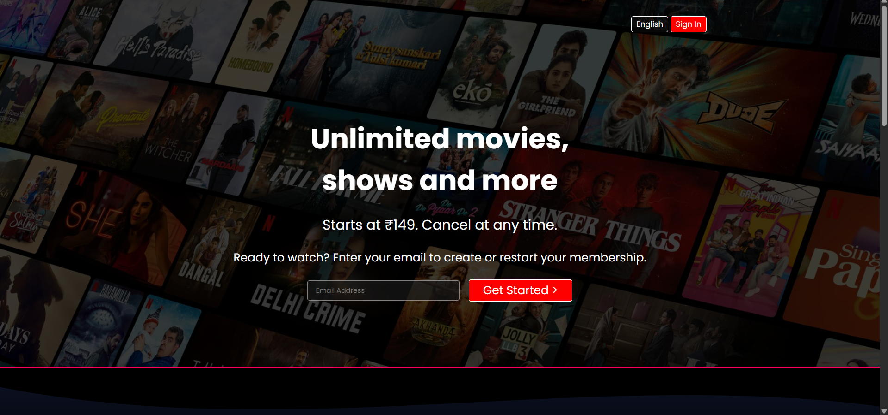
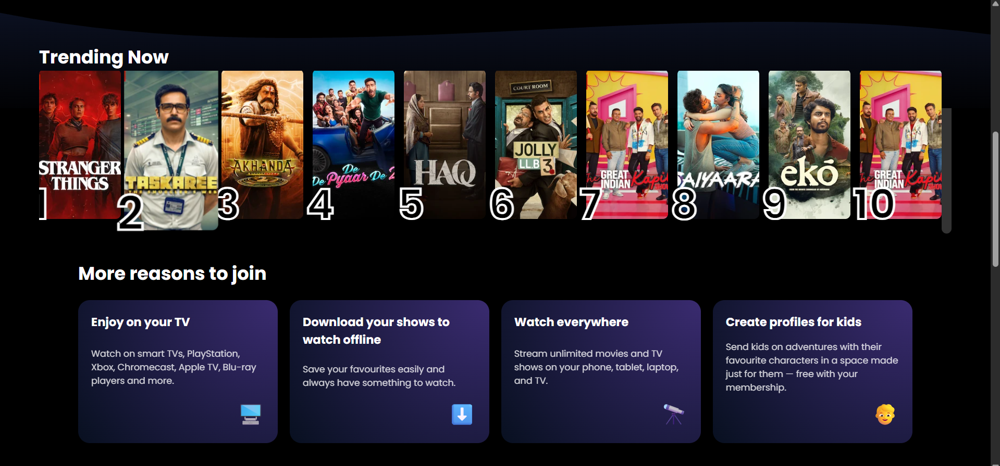
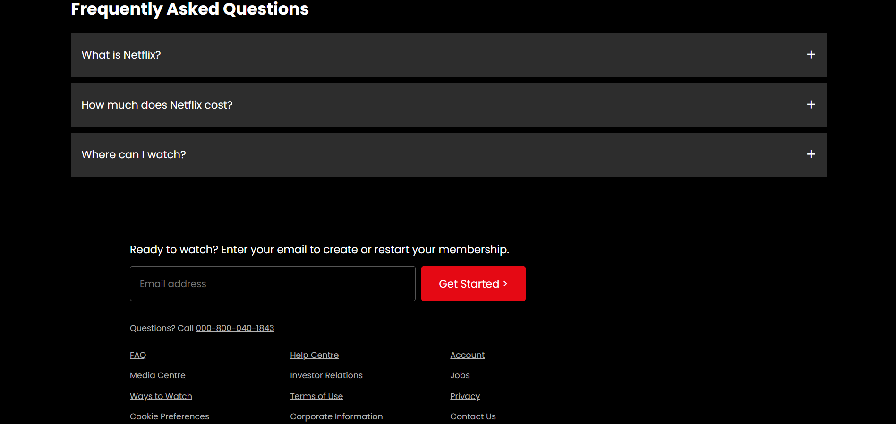

# 🎬 Netflix Clone

A responsive **Netflix landing page clone** built using **HTML5 and CSS3**, inspired by Netflix’s official UI.  
This project focuses on modern layout design, responsiveness, and clean UI recreation.

---

## 🚀 Live Demo
🔗 **Live Site:** *(Add your deployed link here if hosted on GitHub Pages / Vercel)*

---

## ✨ Features

- Pixel-inspired Netflix UI design
- Hero section with email CTA
- Trending movies row layout
- Feature highlight cards
- FAQ accordion-style section
- Clean footer with useful links
- Fully responsive layout

---

## 🛠️ Tech Stack

- **HTML5**
- **CSS3**
- **Responsive Web Design**

---

## 📂 Project Structure

```text
netflix-clone/
├── screenshots/
│   ├── home-page.png
│   ├── trending-section.png
│   └── footer-section.png
├── favicon.ico
├── index.html
├── style.css
└── README.md
```
<div align="center">
  
  
  
</div>


